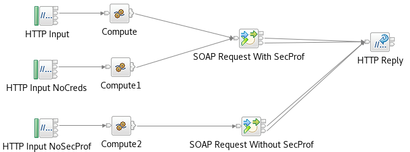

# ace-soap-unt-example
This repo contains an ACE project to demonstrate the use of SOAP UserName Tokens with the ACE SOAP Request node. A dummy
back-end provider flow is included, and will trace out the request message to stdout (using /proc/self/fd/1 on Unix platforms)
so that the token can be inspected.



# Importing and building the project

This repo can be imported into the ACE v11 toolkit using the egit plugin (version 4.11; needed to install from a downloaded 
p2 repo) and then deployed to an ACE server. After the application and policy have been deployed (using the provided BAR file)
the main test flow can be invoked at http://localhost:7800/testFlow to trigger the SOAP call to the back-end flow.

# Testing the project

By default, when the test flow is invoked, it will return successfully with a SOAP message, and the server stdout will show
results including the token; the trace output should contain lines similar to the following:
```
            (0x03000102:NamespaceDecl)http://www.w3.org/2000/xmlns/:wsu                                                          = 'http://docs.oasis-open.org/wss/2004/01/oasis-200401-wss-wssecurity-utility-1.0.xsd' (CHARACTER)
            (0x03000100:Attribute    )http://docs.oasis-open.org/wss/2004/01/oasis-200401-wss-wssecurity-utility-1.0.xsd:Id      = 'unt_20' (CHARACTER)
            (0x03000000:PCDataField  )http://docs.oasis-open.org/wss/2004/01/oasis-200401-wss-wssecurity-secext-1.0.xsd:Username = 'abc' (CHARACTER)
            (0x03000000:PCDataField  )http://docs.oasis-open.org/wss/2004/01/oasis-200401-wss-wssecurity-secext-1.0.xsd:Password = 'def' (CHARACTER)
            (
              (0x03000100:Attribute):Type = 'http://docs.oasis-open.org/wss/2004/01/oasis-200401-wss-username-token-profile-1.0#PasswordText' (CHARACTER)
            )
```

# Triggering different failures

As well as successfully providing UserName Tokens, the projects can be modified slightly to show different failures.

## Failure to specify a security profile

Changing the link from the Compute node so that it goes to the "SOAP Request Without SecProf" node will route the
message to a nod ethat has the correct policy set and bindings, but no security profile specified. When the flow
is invoked, errors of the following form will be returned:
```
<detail><text>Exception. BIP2230E: Error detected whilst processing a message in node &apos;testFlow.SOAP Request Without SecProf&apos;. : /jenkins/slot0/product-build/WMB/src/DataFlowEngine/TemplateNodes/ImbRequestTemplateNode.cpp: 1172: ImbRequestTemplateNode::processMessageAssemblyToFailure: ComIbmSOAPRequestNode: testFlow#FCMComposite_1_5
BIP3754E: The SOAP Request Node or SOAP Async Request Node testFlow.SOAP Request Without SecProf encountered an error while processing the outbound SOAP request. : /jenkins/slot0/product-build/WMB/src/WebServices/WSLibrary/ImbSOAPRequestNode.cpp: 215: ImbSOAPRequestNode::requestData: ComIbmSOAPRequestNode: testFlow#FCMComposite_1_5
BIP3731E: An error occurred during WS-Security processing using policy set &apos;&apos;{UserNameTokenProject}:UNTPolicy&apos;&apos; and policy set binding &apos;&apos;{UserNameTokenProject}:UNTBindings&apos;&apos; with security profile &apos;&apos;&apos;&apos;. : /jenkins/slot0/product-build/WMB/src/WebServices/WSLibrary/ImbSOAPRequestHelper.cpp: 1901: ImbSOAPRequestHelper::makeSOAPRequest: : 
BIP3730E: A UsernameToken is required by the configuration of the WS-Security layer, but the integration node security manager has not provided a username. : /jenkins/slot0/product-build/WMB/src/JNI/ImbJniReturn.cpp: 109: ImbJniReturn::processRootKnownException: : 
BIP3727E: &apos;org.apache.axis2.AxisFault: CWWSS6521E: The Login failed because of an exception: javax.security.auth.login.LoginException: javax.security.auth.login.LoginException: Broker security manager failed to provide a username&apos; : /jenkins/slot0/product-build/WMB/src/JNI/ImbJniReturn.cpp: 109: ImbJniReturn::processRootKnownException: : </text></detail>
```
Note the blank security profile in the BIP3731 error message.

## Failure to provide user/password in the Properties parser

Commenting out the following lines in testFlow_Compute.esql
```
		SET OutputRoot.Properties.IdentitySourceType = 'usernameAndPassword';
		SET OutputRoot.Properties.IdentitySourceToken = 'abc';
		SET OutputRoot.Properties.IdentitySourcePassword = 'def';
```
will stop the flow from providing user/pw information. In this case, the flow will fail when 
called, and will return errors as follows:

```
<detail><text>Exception. BIP2230E: Error detected whilst processing a message in node &apos;testFlow.SOAP Request With SecProf&apos;. : /jenkins/slot0/product-build/WMB/src/DataFlowEngine/TemplateNodes/ImbRequestTemplateNode.cpp: 1172: ImbRequestTemplateNode::processMessageAssemblyToFailure: ComIbmSOAPRequestNode: testFlow#FCMComposite_1_4
BIP3754E: The SOAP Request Node or SOAP Async Request Node testFlow.SOAP Request With SecProf encountered an error while processing the outbound SOAP request. : /jenkins/slot0/product-build/WMB/src/WebServices/WSLibrary/ImbSOAPRequestNode.cpp: 215: ImbSOAPRequestNode::requestData: ComIbmSOAPRequestNode: testFlow#FCMComposite_1_4
BIP3731E: An error occurred during WS-Security processing using policy set &apos;&apos;{UserNameTokenProject}:UNTPolicy&apos;&apos; and policy set binding &apos;&apos;{UserNameTokenProject}:UNTBindings&apos;&apos; with security profile &apos;&apos;Default_Propagation&apos;&apos;. : /jenkins/slot0/product-build/WMB/src/WebServices/WSLibrary/ImbSOAPRequestHelper.cpp: 1901: ImbSOAPRequestHelper::makeSOAPRequest: : 
BIP3730E: A UsernameToken is required by the configuration of the WS-Security layer, but the integration node security manager has not provided a username. : /jenkins/slot0/product-build/WMB/src/JNI/ImbJniReturn.cpp: 109: ImbJniReturn::processRootKnownException: : 
BIP3727E: &apos;org.apache.axis2.AxisFault: CWWSS6521E: The Login failed because of an exception: javax.security.auth.login.LoginException: javax.security.auth.login.LoginException: Broker security manager failed to provide a username&apos; : /jenkins/slot0/product-build/WMB/src/JNI/ImbJniReturn.cpp: 109: ImbJniReturn::processRootKnownException: : </text></detail>
```
In this case, the BIP3731 error message shows a security profile, but because the flow has not
provided any data in the Properties parser, the call still fails.
